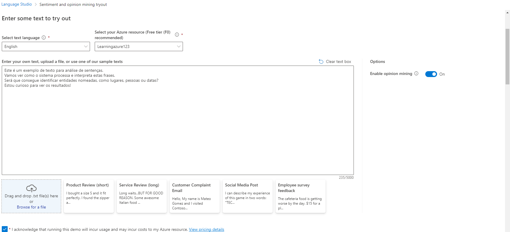
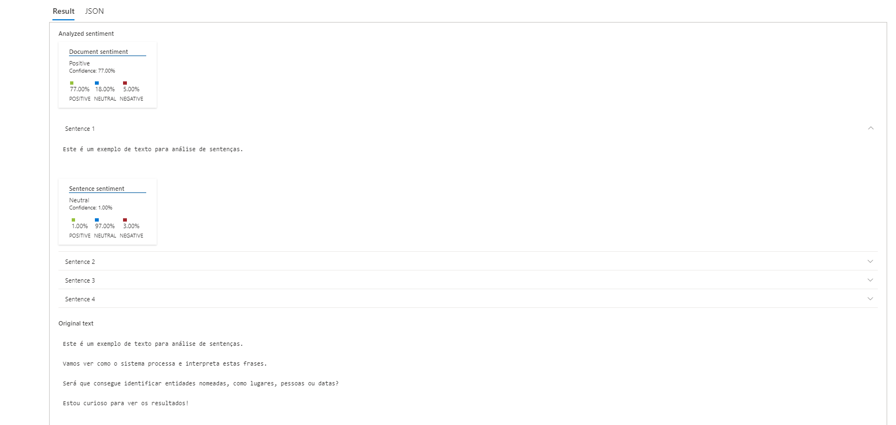
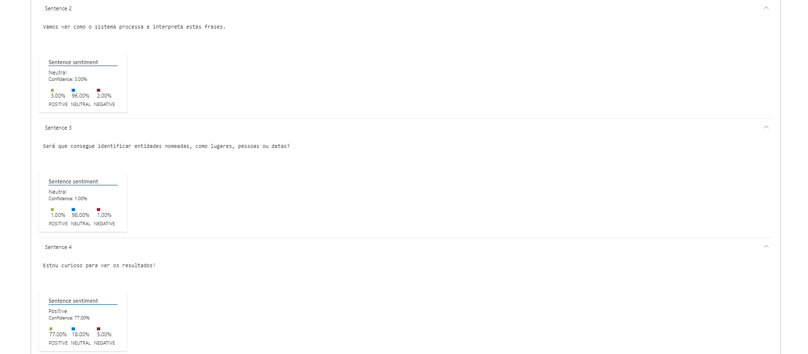

# Portfólio de Projetos por Denis Gaetani

Bem-vindo ao meu portfólio de projetos! Aqui você encontrará um projeto que desenvolvi para demonstrar minhas habilidades em processamento de linguagem natural (NLP).

## Projeto: Análise de Sentenças com Processamento de Linguagem Natural

Neste projeto, explorei técnicas de processamento de linguagem natural para analisar sentenças e extrair insights interessantes. Utilizei o poder da inteligência artificial para entender e interpretar o texto de maneira significativa.

### Estrutura do Projeto

- **inputs/**: Esta pasta contém um documento de texto com algumas sentenças para análise.
- **README.md**: Este arquivo fornece uma visão geral do projeto, insights, e o processo que segui para desenvolvê-lo.

### Como Entregar este Projeto?

1. Crie um novo repositório no GitHub com um nome de sua preferência.
2. Dentro do repositório, crie uma pasta chamada 'inputs' e adicione um documento de texto com algumas sentenças que serão analisadas.
3. Crie um arquivo chamado `README.md` onde você descreverá o processo de análise, insights obtidos e possibilidades exploradas.
4. Compartilhe o link do seu repositório através do botão 'Entregar Projeto'.

### Inputs e outputs imagens

### Insights e Possibilidades

Durante o desenvolvimento deste projeto, explorei diversas técnicas de processamento de linguagem natural, incluindo:

- Tokenização de sentenças.
- Análise de sentimentos.
- Extração de entidades.
- Identificação de tópicos principais.

Além disso, descobri maneiras interessantes de visualizar e interpretar os resultados obtidos, o que me permitiu compreender melhor o conteúdo das sentenças e extrair informações valiosas.

Fico ansioso para compartilhar mais detalhes e aprender com as suas sugestões e feedbacks!

Denis Gaetani
